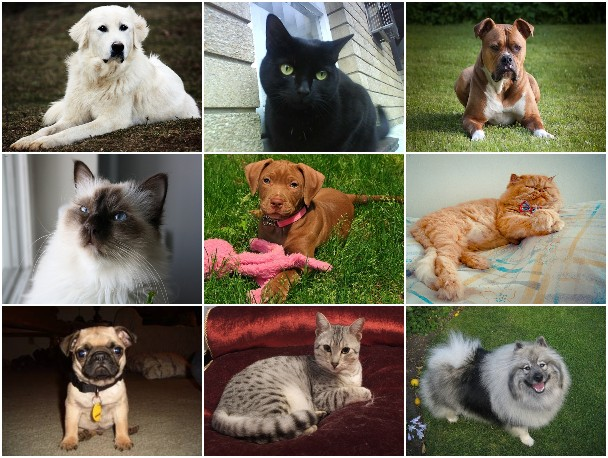

# Dog or Cat?

----

### [Project Description](./doc/project2_desc.md)

Term: Spring 2018

+ Project title: Image Classification: Dog or Cat?
+ Team Number: 3
+ Team Members: Alek Anichowski, Sophie Beiers, Mingyue Kong, Yun Li, Keith Rodriguez
+ Project summary: We created a classification engine for images of cats and dogs. Our baseline model was a GBM model using SIFT features that predicted in a testing trial with an accuracy rate of 72%, but we ultimately considered Random Forest, Logistic Regression, Neural Net and SVM models. In the end, our most advanced model was a combination of Random Forest, Logistic Regression and SVM that used majority vote to predict cats and dogs. When given a whole new set of testing images, our model predicted cats and dogs correctly at a rate of 75%.  To reproduce our code, please turn to the [main.rmd](./doc/main.Rmd). For a readable version of our project steps and code, please turn to [main.html](./output/main.html).
+ Contribution statement: Alek developed the SIFT features, created a neural net model, worked on main.Rmd, combined models to obtain final model, cleaned up code and presented. Sophie developed the HOG features and a Random Forest model trained on all combinations of features, worked on the main.Rmd, wrote README.md files and presented. Yun extracted color features and developed a logistic regression model trained on all combinations of features, and created the presentation. Mingyue developed SVM models using a linear and RBF kernel and developed LBP features with Matlab. Keith made altered images for training. All team members approve our work presented in this GitHub repository including this contributions statement.

Following [suggestions](http://nicercode.github.io/blog/2013-04-05-projects/) by [RICH FITZJOHN](http://nicercode.github.io/about/#Team) (@richfitz). This folder is organized as follows.

```
proj/
├── lib/
├── data/
├── doc/
├── figs/
└── output/
```

Please see each subfolder for a README file.
